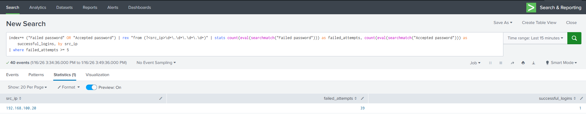
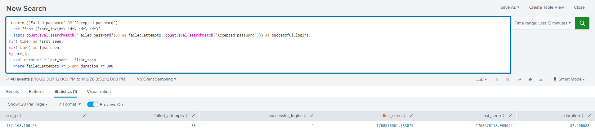

# SSH Brute Force using Hydra Detection

## Scenario Overview
This scenario demonstrates the detection of an automated SSH brute-force attack using Hydra in a controlled SOC homelab environment.
The goal is to practice identifying suspicious authentication behavior using log analysis and time-based detection logic in Splunk.

## Lab Environment
This scenario was executed using the existing SOC homelab environment described in the root README, consisting of a Splunk SIEM, Ubuntu victim, and Kali attacker within an isolated internal network.

## Attack Simulation
The attacker system (Kali Linux) attempted to discover valid SSH logins credentials against the victim machine using Hydra.
A total of 39 failed login attempts were generated, followed by 1 successful login.
All attack activity was performed within an isolated internal network environment.

## Log Analysis
SSH authentication logs were collected from the victim system and analyzed in Splunk.

Key fields used in this analysis:
- src_ip: Source IP address of the SSH login attempts
- failed_attempts: Number of failed SSH authentication attempts
- successful_logins: Number of successful SSH logins
- duration: Time window between the first and last login attempt

## Detection Logic
This scenario uses the following detection rule:

- `detection/ssh_bruteforce.spl`
- `detection/ssh_bruteforce_time_window.spl`

This detection logic identifies a high volume of failed SSH authentication attempts from a single source IP within a short time window, followed by a successful login.
This behavior is a strong indicator of an automated brute-force attack that resulted in potential account compromise.

## Screenshots

## Lessons Learned
- Automated SSH login attempts help distinguish normal user behavior from manual brute-force attacks.
- Time-based thresholds are critical for reducing false positives in authentication monitoring.
- Preserving raw logs while selectively using relevant fields is essential for effective SOC analysis.
- Documenting detection logic improves repeatability and investigation consistency.
- Automated attacks generate consistent, high-frequency log patterns that are well-suited for threshold-based detection.

