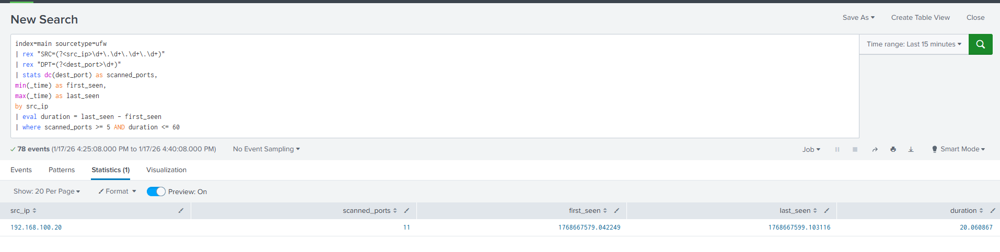

# Port Scan Detection

## Scenario Overview
This scenario demonstrates the detection of a TCP SYN port scanning attack using nmap in a controlled SOC homelab environment.
The goal is to practice identifying suspicious scanning behavior using log analysis and time-based detection logic in Splunk.

## Lab Environment
This scenario was executed using the existing SOC homelab environment described in the root README, consisting of a Splunk SIEM, Ubuntu victim, and Kali attacker within an isolated internal network.

## Attack Simulation
The attacker system (Kali Linux) attempted to discover open ports against the victim machine.
The scan targeted multiple TCP ports within a short time window to simulate reconnaissance activity.
All attack activity was performed within an isolated internal network environment.

## Log Analysis
UFW logs were collected from the victim firewall and analyzed in Splunk.

Key fields used in this analysis:
- src_ip: Source IP address of the port scan activities
- scanned_ports: Number of sccaned_ports
- duration: Time window between the first and last scan attempt

## Detection Logic
This scenario uses the following detection rule:

- `detection/port_scan_time_window.spl`

This detection logic identifies port scanning activities from a single source IP within a short time window.
This behavior is a strong indicator of reconnaissance activity that may precede further attacks.

## Screenshots

## Lessons Learned
- Port scanning activity does not generate authentication logs and therefore cannot be detected using auth.log alone.
- Firewall or network-level logs are required to detect scanning behavior that does not trigger application-level events.

