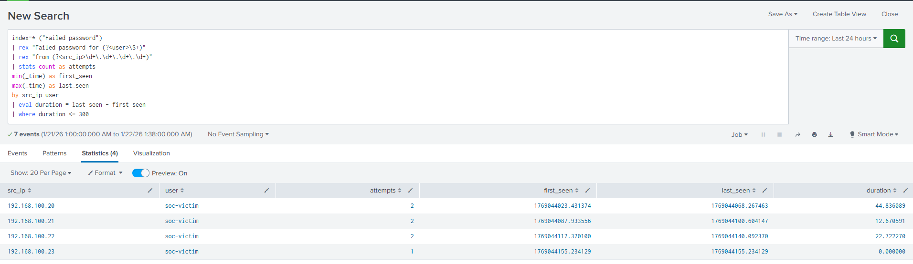

# Distributed SSH Brute Force Detection

## Scenario Overview
This scenario demonstrates the detection of an SSH brute-force attack in a controlled SOC homelab environment.
The objective is to practice identifying suspicious authentication behavior through log analysis and
time-based detection logic using Splunk.

## Lab Environment
This scenario was executed using the existing SOC homelab environment described in the root README.
The lab consists of a Splunk SIEM, an Ubuntu victim machine, and a Kali Linux attacker,
all operating within an isolated internal network.

## Attack Simulation
The attacker system (Kali Linux) performed multiple SSH login attempts from multiple source IPs targeting the victim machine
using incorrect credentials.
A total of 7 failed login attempts were generated, followed by 1 successful login.
All attack activity was conducted within the internal lab network without external internet access.

## Log Analysis
SSH authentication logs (`auth.log`) were collected from the victim system and analyzed in Splunk.

Key fields used in this analysis:
- `src_ip`: Source IP address of the SSH login attempts
- `user`: User targeted by src_ip
- `attempts`: Number of failed SSH authentication attempts by each src_ip
- `duration`: Time window between the first and last login attempt (e.g 5min)

## Detection Logic
This scenario references the following detection queries:

- `detection/ssh_failed_attempts_by_srcIP_user.spl`
- `detection/ssh_failed_attempts_by_srcIP_user_time_window.spl`

The detection logic identifies multiple failed SSH authentication attempts originating from multiple
source IPs within a short time window, followed by a successful login.
This behavior is a strong indicator of a brute-force attack that may have resulted in account compromise.

## Screenshots

## Lessons Learned
- Traditional brute-force detection methods cannot reliably detect distributed attacks.
- Time-based thresholds are effective for distinguishing brute-force attacks from legitimate login failures.
- Authentication logs provide sufficient visibility to detect SSH brute-force activity.
- Clearly documenting detection logic improves investigation repeatability and SOC analyst efficiency.
